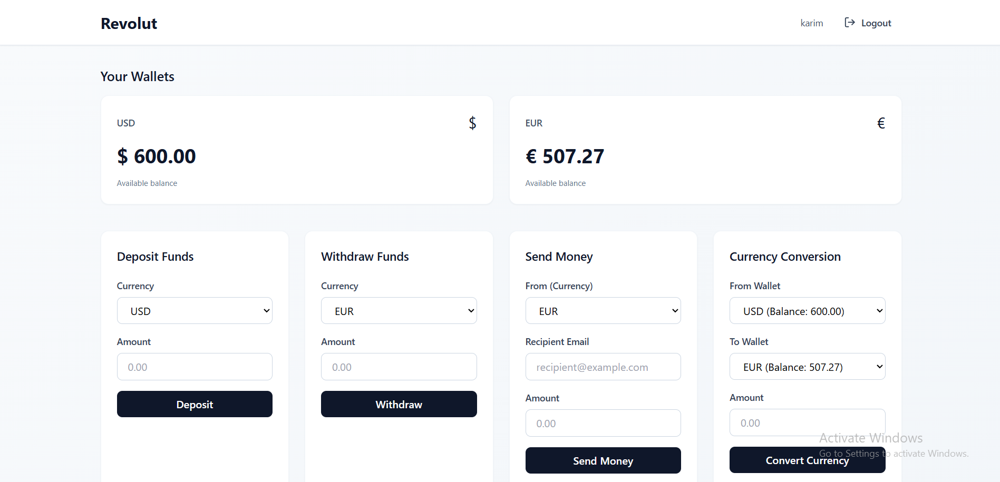
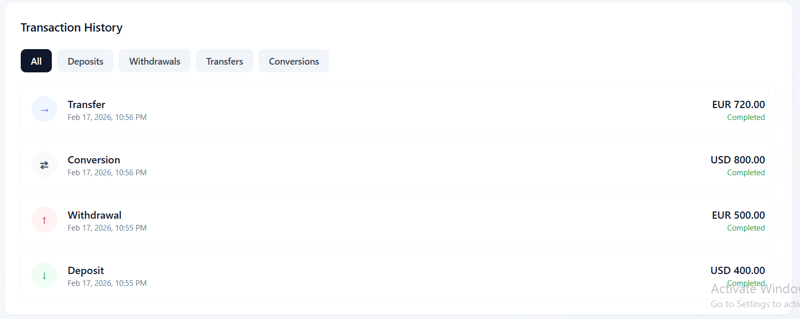

# Mini-Revault – FinTech Wallet System

A simplified digital banking web application built with NestJS, PostgreSQL, and React.

The system supports secure authentication, multi-currency wallets (EUR & USD), atomic money transfers, transaction history, and monthly spending analytics.

This project focuses on financial integrity, concurrency safety, and scalable backend architecture rather than feature completeness.

## Live Demo

Frontend: https://mini-revault-app.vercel.app  
Backend API: https://imaginative-youthfulness-production-ac85.up.railway.app
API Swagger documentation (for Auth & transactions): https://imaginative-youthfulness-production-ac85.up.railway.app/docs/api

*NOTE*: there is a little delay due to free hosting limitations

## Tech Stack

Backend:
- NodeJS
- NestJS
- PostgreSQL
- TypeORM
- JWT Authentication
- Docker (local development)

Frontend:
- React JS

Infrastructure:
- Railway (Backend + PostgreSQL)
- Vercel (Frontend)

## Local Development

### Using Docker

docker-compose up --build

### Manual Setup

Backend:
cd backend
npm install
npm run start:dev

Frontend:
cd frontend
npm install
npm run dev

## Environment Variables
Example (.env):

DATABASE_URL=
JWT_SECRET=
FRONTEND_URL=
PORT=

## Architecture Overview

The backend follows a modular architecture:

Controller → Service → Repository → Database

Modules:
- Auth
- Wallets
- Transactions
- Analytics

Financial operations (deposit, withdrawal, transfer, currency conversion) are executed inside database transactions using pessimistic row locking to prevent race conditions and double-spending.

## Database Design

### User
- id (UUID)
- fullName
- email (unique)
- passwordHash
- role
- isFrozen
- createdAt

### Wallet
- id (UUID)
- userId (FK)
- currency (EUR, USD)
- balance_cents (INT)
- CHECK (balance_cents >= 0)

All monetary values are stored in the smallest currency unit (cents) to avoid floating-point precision issues.

### Transaction
- id (UUID)
- type (deposit, withdrawal, transfer, conversion)
- senderWalletId (nullable)
- receiverWalletId (nullable)
- amount_cents (INT)
- status
- createdAt

## Security Considerations

- Passwords hashed using bcrypt.
- JWT-based authentication with expiration.
- Input validation using class-validator.
- Monetary operations executed inside DB transactions.
- Pessimistic locking (SELECT ... FOR UPDATE) prevents race conditions.
- Database constraint ensures non-negative balances.
- No floating-point arithmetic used for money handling.
- Secrets managed through environment variables.

## Financial Integrity

All financial operations follow this pattern:

1. Begin database transaction.
2. Lock relevant wallet rows (FOR UPDATE).
3. Validate balance.
4. Apply balance updates.
5. Insert transaction record.
6. Commit transaction.

This guarantees atomicity and prevents double-spending.

## Currency Conversion

- Exchange rates are stored as scaled integers to avoid floating-point precision errors.
- Conversion uses fixed-point arithmetic:
- converted_amount = (amount * rate) / scale
- Floor rounding is applied to prevent over-crediting.

*Check "backend/docs/math.md"*

## Scaling Strategy
1. Stateless Authentication

The API uses JWT-based authentication, which allows the backend to remain stateless.
This enables horizontal scaling behind a load balancer without session synchronization.

In a 1M-user scenario:

Multiple backend instances could run behind a reverse proxy (e.g., Nginx).
Each instance can validate JWTs independently using the shared secret.

2. Database Connection Pooling

PostgreSQL connection pooling would be configured to handle high concurrency.

In production:

A connection pooler such as PgBouncer would manage DB connections.
Backend instances would use a limited pool size to avoid exhausting database connections.
This prevents connection bottlenecks under heavy traffic.

3. Separation of Read and Write Workloads

Financial operations (transfers, withdrawals) are write-heavy and must remain strongly consistent.
Analytics queries (monthly spending) are read-heavy and can be isolated.

To scale:

- Introduce PostgreSQL read replicas.
- Route analytics queries to replicas.
- Keep all monetary writes on the primary node.
- This reduces contention and improves performance without compromising consistency.

4. Future Improvement: Ledger-Based Architecture

For higher financial reliability, wallet balances could be derived from an immutable transaction ledger rather than stored directly.

Instead of:

Updating wallet balance directly,

We would:

- Append transaction entries.
- Compute balances from ledger events.
- This approach improves auditability and financial traceability.
- Rate limiting by using Redis-backed Throttler for distributed apps

## Production Improvements

For banking scale systems, the following is suggested:

- Multi-factor authentication (MFA)
- Fraud detection engine
- Event-sourced ledger system
- Audit logging with immutability
- Hardware Security Module (HSM) for key management
- Encrypted backups
- KYC integration

